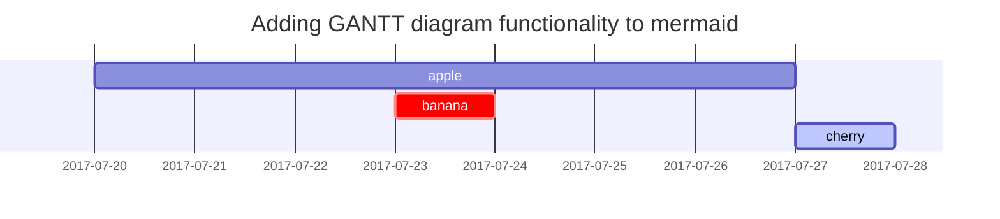
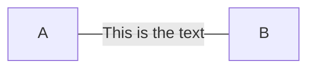

---
# https://chirpy.cotes.page/posts/write-a-new-post/
title: Markdown Tips
date: 2023-08-22 12:33:00 +0300
#description: Hello World
tags: ["markdown"]
categories: ["markdown"]
math: true
mermaid: true
toc: true
---

## Colorful Text (Prompt)

> This is tip.
{: .prompt-tip}
> This is info.
{: .prompt-info}
> This is warning.
{: .prompt-warning}
> This is danger.
{: .prompt-danger}

## Footnote

Click the hook will locate the footnote[^footnote], and here is another footnote[^fn-nth-2].

## Mermaid SVG

Mermaid is a simple markdown-like script language for generating charts from text via javascript. See [Mermaid](https://jojozhuang.github.io/tutorial/mermaid-cheat-sheet/) for more details.

Remember that you should include the `mermaid: true` in the front matter.





## Images

### Default (with caption)

```markdown
{: width="972" height="589" }
_Full screen width and center alignment_
```

### Left aligned

```markdown
{: width="972" height="589" .w-75 .normal}
```

### Float to left

```markdown
{: width="972" height="589" .w-50 .left}
Praesent maximus aliquam sapien. Sed vel neque.
```

### Float to right

```markdown
{: width="972" height="589" .w-50 .right}
Praesent maximus aliquam sapien. Sed vel neque 
```

## Video

You can embed a YouTube video by using the following snippet: `{ % include embed/youtube.html id='Balreaj8Yqs' %}` (Remove the space between `{` and `%` in the snippet.)



## Latex

This is rho: `$\rho$` $\rho$. Remember that you should include the `math: true` in the front matter.

$$ \rho \frac{\frac{D}{c} \mathbf{u}}{D t} = - \nabla p + \nabla \cdot \mathbf{T} + \mathbf{f} $$

## Description list

Sun
: the star around which the earth orbits.

Moon
: the natural satellite of the earth, visible by reflected light from the sun

## ToDo list

- [ ] Job
  - [x] Step 1
  - [x] Step 2
  - [ ] Step 3

## Reverse Footnote

[^footnote]: The footnote source
[^fn-nth-2]: The 2nd footnote source
